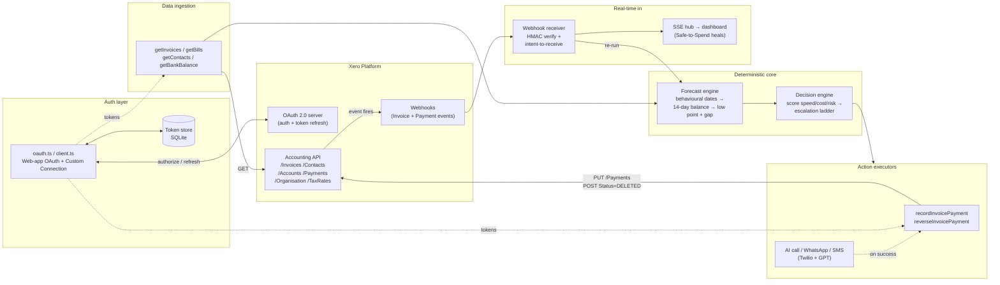

# 🍋 Squeeze

**Squeeze your receivables before your payables squeeze you.**

Squeeze is an AI credit controller that lives on your Xero data. It predicts the exact day your cash will run short, pinpoints the specific unpaid invoices causing the gap, and takes the cheapest effective action to close it — a polite nudge, an AI phone call, an early‑payment discount, invoice financing, or a court‑ready Letter Before Action — always proportionate, always with you approving the serious steps.

Big companies have credit controllers, treasury desks and procurement teams keeping them cash‑positive. The 4.4M small businesses on Xero have the owner, at 9pm, embarrassed to chase a friend for money. Squeeze gives a 4‑person business the receivables muscle of a 400‑person one, for the price of a subscription.

---

## The problem

- Small businesses don't go broke from bad dashboards. They go broke because an invoice paid three weeks late lands *after* payroll.
- Xero's own short‑term cash flow assumes everyone pays on the due date. Overdue invoices with no expected date **vanish from the forecast** — Xero's own community calls it "almost redundant."
- The enterprise fix is a *person* (a credit controller, ~£30–40k/yr) or a *platform* (procurement suites from ~$3,000/mo). Neither is reachable for a plumber or a caterer.

## What Squeeze does

One brain (your Xero org), one number the owner cares about — **Safe to Spend** — and a credit controller working behind it:

1. **Predicts the gap** — 14‑day cash view using how each customer *actually* pays (behavioural dates), not naive due dates. Surfaces the lowest point: *"Thursday you'll be £1,180 under safe cash."*
2. **Finds the cause** — ranks the specific unpaid invoices driving the gap.
3. **Picks the move** — for each invoice, proposes the cheapest effective action, scored on **speed / cost / relationship risk**.
4. **Acts, on approval** — executes, writes everything back to Xero, and the Safe‑to‑Spend number visibly **heals** when payment lands.

And it knows **when *not* to squeeze**: a loyal customer who always pays a little late gets a gentle nudge; a first‑timer who's ghosted two emails gets the firm path.

## Why it wins (positioning)

- **JAX‑proof by construction.** Everything Squeeze does acts *outward* — toward debtors, lenders, suppliers. Xero's own assistant will never pressure one Xero customer for another, or broker against Xero's financing partners. Cash‑flow + polite chasing is on JAX's roadmap; adversarial, cross‑party action is not.
- **Differentiated from incumbents.** Chaser chases on a schedule regardless of whether you need the cash. Paidnice applies fees. Satago finances. Garfield sends legal letters. **None connects the action to your cash position.** Squeeze is the *decision layer*.
- **Track fit.** Targets the Xero hackathon **Revenue / data‑&‑insights track**: analyse accounting data → surface actionable insights → take proactive steps to improve cash flow, combining *data analysis + autonomous action → measurable outcomes*.

---

## Documentation

| Doc | What's in it |
|---|---|
| [`docs/PRODUCT_SPEC.md`](docs/PRODUCT_SPEC.md) | Full product spec: users, the loop, the escalation ladder, scope & compliance |
| [`docs/DECISION_ENGINE.md`](docs/DECISION_ENGINE.md) | Everything Squeeze weighs + forecast & scoring pseudocode |
| [`docs/ARCHITECTURE.md`](docs/ARCHITECTURE.md) | Stack, components, data flow, repo layout |
| [`docs/XERO_INTEGRATION.md`](docs/XERO_INTEGRATION.md) | Endpoints, OAuth scopes, webhooks, MCP server, seed data |
| [`docs/BUILD_PLAN.md`](docs/BUILD_PLAN.md) | 48‑hour phased plan, hour budget, fallback tiers |
| [`docs/DEMO_SCRIPT.md`](docs/DEMO_SCRIPT.md) | 3‑minute pitch mapped to the judging rubric |

## How Xero is integrated

Squeeze connects to a Xero org and turns the ledger into a live 14‑day cash‑flow forecast with one headline number, **Safe to Spend**. On connect we read receivables and bills from `/Invoices`, customers from `/Contacts`, and bank balances from `/Accounts`, then run a deterministic engine that projects the running balance day‑by‑day using each customer's behavioural payment dates rather than naive due dates. That surfaces the exact low point and shortfall (e.g. "Thursday you're £1,180 under safe cash") and ranks the specific unpaid invoices causing it. No LLM touches the arithmetic — the forecast, low‑point detection and gap are pure reproducible code.

On top of that sits a decision engine that scores each culpable invoice on speed, cost and relationship risk and picks the cheapest effective action along a proportionate escalation ladder (watch → soft nudge → firm reminder → AI phone call → early‑pay discount → financing → Letter Before Action), including logic for when *not* to chase a reliable payer. Serious rungs need owner approval. The AI layer only drafts messages, answers questions in a copilot, and runs the outbound call (Twilio Voice: speech‑to‑text → GPT reply → text‑to‑speech), with WhatsApp/SMS for gentler rungs.

When an action succeeds we write the settlement back to Xero via `/Payments` (and reverse it with `/Payments/{id}` `Status=DELETED` so the demo is repeatable). The integration is webhook‑driven: a signed Xero webhook (HMAC `x-xero-signature` verification plus the intent‑to‑receive handshake) fires on Invoice and Payment events, re‑runs the forecast, and streams the update to the dashboard over Server‑Sent Events, so Safe to Spend visibly heals the moment money lands.

Implementation is a Next.js app using `xero-node`, with OAuth 2.0 (both standard Web‑app auth with refresh‑token rotation and Custom Connection client‑credentials) on granular scopes `accounting.invoices`, `accounting.payments`, `accounting.contacts`, `accounting.settings`, `offline_access`. SQLite holds state including durable call sessions that survive restarts, and every call and payment is logged for a full audit trail written back into Xero.

## Status

Built for the Encode × Xero App & Agent Hackathon (London, 4–5 Jul 2026). Next.js app with a live Xero integration: deterministic forecast + decision engine, webhook‑driven real‑time healing, and AI‑assisted collections (copilot, WhatsApp, outbound voice).
