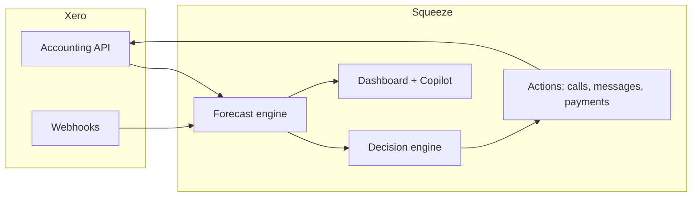

# Squeeze

**The AI credit controller for Xero.**

Squeeze your receivables before your payables squeeze you.

---

Small businesses don't go broke from bad dashboards. They go broke because an invoice paid three weeks late lands *after* payroll. Big companies have credit controllers and treasury teams keeping them cash-positive. The 4.4 million small businesses on Xero have the owner — at 9pm, embarrassed to chase a friend for money.

**Squeeze gives a 4-person business the receivables muscle of a 400-person one.**

Connect your Xero organisation and get one number you can trust: **Safe to Spend**. When cash is about to run short, Squeeze finds the invoices causing the gap, recommends the right action, and handles the follow-up — always proportionate, always with you in control.

---

## Why Squeeze

| Without Squeeze | With Squeeze |
|---|---|
| Cash forecasts assume everyone pays on the due date | 14-day forecast based on how each customer *actually* pays |
| Overdue invoices with no expected date vanish from the picture | Every receivable is tracked with a behavioural payment date |
| Chasing is manual, awkward, and easy to put off | Escalation is automatic, scored, and relationship-aware |
| No one owns collections until it's a crisis | An AI credit controller works the gap before payroll hits |

---

## What you get

### Safe to Spend
A single headline number: how much cash you can safely use right now, after upcoming bills, payroll, and your safety buffer. Updated in real time as payments land.

### Gap prediction
See exactly when cash will run short — *"Thursday you'll be £1,180 under safe cash"* — with a day-by-day 14-day cash curve, not a static report.

### Root-cause diagnosis
Squeeze ranks the specific unpaid invoices driving the shortfall, so you know who to focus on and why.

### Smart escalation
For each invoice, Squeeze picks the cheapest effective action along a proportionate ladder:

- **Watch** — reliable payer, gap not urgent yet
- **Soft nudge** — polite email or WhatsApp reminder
- **Firm reminder** — terms passed, nudge ignored
- **AI phone call** — disclosed B2B call when cash is needed soon
- **Early-payment discount** — fast cash without burning the relationship
- **Invoice financing** — when chasing is too slow
- **Letter Before Action** — court-ready documentation for genuine non-payers

Serious steps require your approval. Squeeze knows when *not* to squeeze — a loyal customer who always pays a little late gets a gentle nudge; a first-timer who's ghosted two emails gets the firm path.

### Real-time healing
When a payment lands in Xero, your forecast updates instantly. Safe to Spend visibly recovers — the moment money hits, you see it.

### Full audit trail
Every action, call, and note is logged and written back to Xero. Nothing happens in the dark.

---

## How it works

```
  1. PREDICT  →  14-day Safe to Spend forecast
  2. DIAGNOSE →  which invoices cause the gap
  3. DECIDE   →  best action per invoice, ranked
  4. ACT      →  execute on your approval, write back to Xero
         ▲                              │
         └──── forecast heals on payment ┘
```

1. **Connect Xero** — Squeeze reads your invoices, contacts, bills, and bank balance.
2. **See your gap** — a deterministic forecast engine projects cash day by day using behavioural payment dates.
3. **Review actions** — the decision engine scores speed, cost, and relationship risk for each invoice.
4. **Approve and act** — Squeeze sends messages, places calls, or prepares documents. You stay in control.

---

## Built for

Tradespeople, agencies, caterers, cleaners, consultants, and small wholesalers — any Xero business that sells on payment terms and feels cash timing pain. Typically 1–20 people, no finance staff, owner doing the chasing (or avoiding it).

**B2B only.** Squeeze chases your business customers on your own invoices — not consumer debt, not third-party collection. AI is disclosed on every call. Human approval gates every serious escalation.

---

## Integrations

**Xero** — OAuth 2.0 connection with read access to invoices, contacts, accounts, and settings; write access for payments and notes. Webhook-driven updates keep your dashboard live.

**Twilio** — WhatsApp, SMS, and AI voice calls for collections outreach.

**OpenAI** — Copilot for questions about your cash position; GPT-powered dialogue on outbound calls.

---

## Get started

### Prerequisites

- Node.js 20+
- A [Xero developer app](https://developer.xero.com/) with accounting scopes
- API keys for OpenAI and Twilio (for copilot and outbound comms)

### Run locally

```bash
git clone https://github.com/gabikreal1/squeeze.git
cd squeeze
npm install
cp .env.example .env   # fill in your keys
npm run db:migrate
npm run dev
```

Open [http://localhost:3000](http://localhost:3000), connect your Xero organisation, and Squeeze will build your first forecast.

For a public tunnel (required for Xero webhooks and Twilio voice), set `PUBLIC_BASE_URL` to your HTTPS URL.

---

## Architecture

Squeeze is a Next.js application with a deterministic forecast core and an AI-assisted action layer.

- **Forecast engine** — behavioural payment dates, 14-day balance projection, gap detection. Pure code, no LLM in the arithmetic.
- **Decision engine** — scores each invoice on speed, cost, and relationship risk; selects the escalation rung.
- **Action executors** — Twilio voice/WhatsApp/SMS, payment recording via Xero `/Payments`, audit logging.
- **Real-time layer** — Xero webhooks trigger forecast re-runs; Server-Sent Events push updates to the dashboard.



---

## Documentation

| Document | Description |
|---|---|
| [`docs/PRODUCT_SPEC.md`](docs/PRODUCT_SPEC.md) | Product overview, user personas, the action ladder, compliance |
| [`docs/DECISION_ENGINE.md`](docs/DECISION_ENGINE.md) | Scoring model and escalation logic |
| [`docs/ARCHITECTURE.md`](docs/ARCHITECTURE.md) | Stack, components, data flow, repo layout |
| [`docs/XERO_INTEGRATION.md`](docs/XERO_INTEGRATION.md) | OAuth, endpoints, webhooks, scopes |

---

## License

Proprietary — see [LICENSE](LICENSE).
